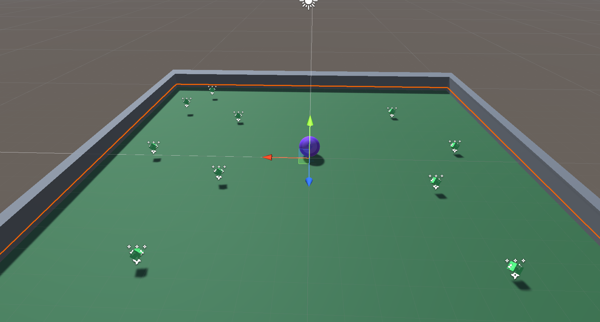
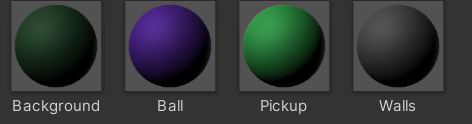
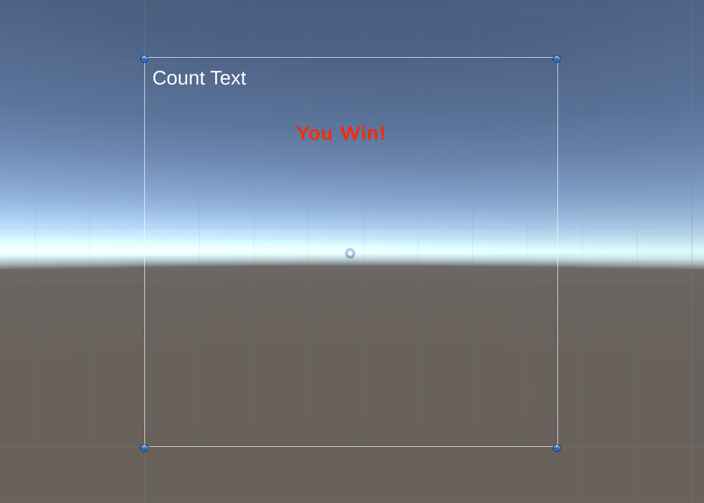
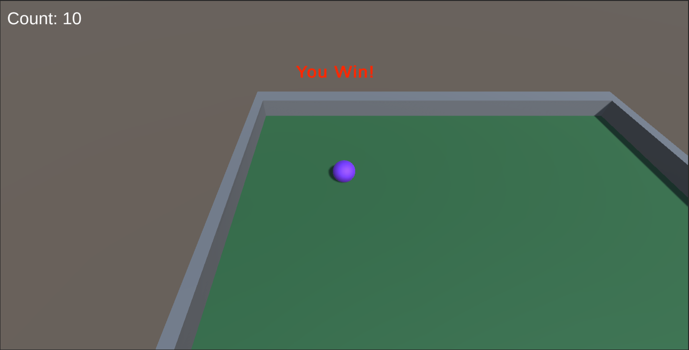
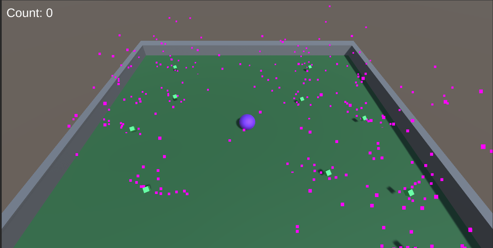

README.md

# rolling_a_ball

**This Game was created in the Unity Software**

Welcome to Rolling a Ball! A game to you can be a pretty little ball and pickup pretty little blocks!

This was the game in development. I got a tad overboard and wanted to be a bit fancy, so I added particles to pickups that the player can pick up!

These were the materials used. As you can see, the color of the pickups are a neon-ish green whole your a beautiful purple. The walls are a boring color, but you gotts focus on the pickups and not some dumb walls. 

Here in editing mode, you can see there is a Count Text and a Win Text. This, along with some C# scripting, will count how many pickups you collect. If you pick up all 10 pickups, you win! Easy Peasy!

This is the end product! You can move the ball around using the WASD keys on your keyboard and collect cool looking pickups! After picking up all 10 pickups, you win! Simple but fun and eye-catching!